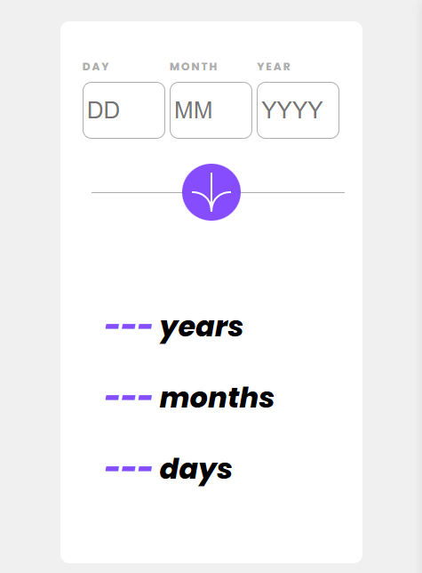

# Frontend Mentor - Age calculator app solution

This is a solution to the [Age calculator app challenge on Frontend Mentor](https://www.frontendmentor.io/challenges/age-calculator-app-dF9DFFpj-Q). Frontend Mentor challenges help you improve your coding skills by building realistic projects. 

## Table of contents

- [Overview](#overview)
  - [The challenge](#the-challenge)
  - [Screenshot](#screenshot)
  - [Links](#links)
- [My process](#my-process)
  - [Built with](#built-with)
  - [Useful resources](#useful-resources)
- [Author](#author)

## Overview

### The challenge

Users should be able to:

- View an age in years, months, and days after submitting a valid date through the form
- View the optimal layout for the interface depending on their device's screen size
- See hover and focus states for all interactive elements on the page

As of April 14th, 2023, users do not receive validation errors if: 
  - Any field is empty when the form is submitted
  - The day number is not between 1-31
  - The month number is not between 1-12
  - The year is in the future
  - The date is invalid e.g. 31/04/1991 (there are 30 days in April)

I will continue to work on it in the near future, as well as my math for the exact age calculation. Blame Rome. I do. 

### Screenshot

### Links

[Repo](https://github.com/er1927)
[Live Site](https://age-calculator-app-nine.vercel.app/)

## My process

### Built with

- Semantic HTML5 markup
- CSS custom properties
- Flexbox
- Mobile-first workflow
- JavaScript

### Useful resources

- [Fellow Tuts](https://fellowtuts.com/html-css/html5-required-attribute-validation-not-working/) - I hadn't come across this site before while troubleshooting, and even though it didn't fix my bugs, I found it very helpful, concice and well written; I will definitely add this site to my list of go-to resources. Thanks, Amit!

## Author

- Website - [Elizabeth Roberts](https://er1927.github.io/personal-portfolio/)
- Frontend Mentor - [@er1927 ](https://www.frontendmentor.io/profile/er1927)
- Github - [@er1927](https://github.com/er1927)
